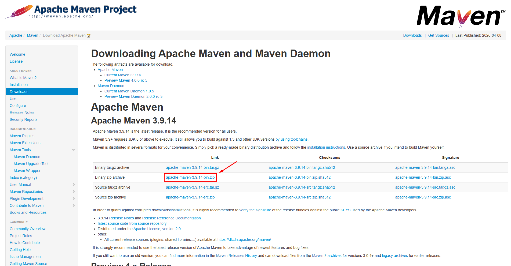

# 🏛️ ObservaAção — Sistema de Solicitações Públicas

Projeto desenvolvido como parte da **Atividade de Estudo Programada (AEP)** do curso de **Engenharia de Software — Unicesumar (2026)**.

---

## 🎯 Objetivo do Projeto

Desenvolver um sistema que permita ao cidadão:

* Registrar solicitações de serviços públicos
* Acompanhar o andamento das suas solicitações
* Receber retornos claros e rastreáveis
* Acessar informações com mais transparência

Além disso, o sistema permite que **servidores e gestores** organizem e tratem demandas de forma eficiente.

---

## 🌎 Contexto

A transformação digital impacta diretamente o acesso a serviços públicos.
Este projeto foi idealizado para reduzir barreiras como:

* Falta de transparência
* Dificuldade de acompanhamento de solicitações
* Desigualdade no acesso a serviços
* Falta de confiança nas instituições

---

## 🧩 Funcionalidades

### 👤 Cidadão

* Cadastro de solicitações (categoria, descrição, localização)
* Opção de envio anônimo ou identificado
* Consulta por protocolo
* Acompanhamento de status e prazos

### 🏢 Sistema / Gestão

* Fila de atendimento organizada por prioridade
* Atualização de status:

  * Aberto → Triagem → Em execução → Resolvido → Encerrado
* Histórico completo das movimentações
* Comentários obrigatórios nas atualizações

---

## ⚙️ Regras de Negócio

* Solicitações anônimas possuem restrições de dados
* Prioridade define prazo (SLA) e impacto
* Sistema possui validações para evitar uso indevido
* Todas as ações são registradas para rastreabilidade

---

## 📗 Como usar o Sistema

* Para conseguir utilizar o nosso sistema é necessário ser instalado o Maven na sua máquina para compilar o "ObservaAcao.bat"
* Ou simplesmente executar o nosso projeto pela sua IDE de Java
### 1. Baixar o Maven
* Acesse o site oficial e baixe a versão zip do apache
* https://maven.apache.org/download.cgi

### 2. Extrair o Arquivo
* Extraia o arquivo em alguma pasta, como por exemplo

``C:\Program Files (x86)\Maven``

### 3. Configurar variáveis de ambiente
* Pressione ``Win + R``
* Digite ``sysdm.cpl``
* Aba **Avançado**
* Clique em **Variáveis de Ambiente**

* Crie uma nova variável
 
* Adicione o nome de ``MAVEN_HOME`` 
* E seu valor com o caminho da sua pasta exemplo ``C:\Program Files (x86)\Maven``

* Após isso Edite a variável ``Path``

* Adicione um novo com o valor ``%MAVEN_HOME%\bin``

### 4. Verifique se o Java está instalado

* Execute os seguintes comandos no **cmd**
``java -version`` e
``javac -version``
* O Maven precisa do **Java Development Kit**

### 5. Testar a instalação
* Abre o **cmd** e digite ``mvn -version``

---

## 🧠 Etapas do Projeto

### 📌 1º Bimestre

* IHC: Perfis e Personas
* Desenvolvimento de versão Beta (POO)
* Aplicação de Clean Code

✔️ Implementação de classes como:

* Solicitacao
* Usuario
* Categoria
* HistoricoStatus

---

### 📌 2º Bimestre

* Criação de Wireframes
* Evolução para arquitetura com Spring Boot
* Análise de métricas de código (qualidade e manutenção)

Ferramentas utilizadas:

* SonarQube / SonarCloud
* Checkstyle / PMD
* SpotBugs

---

## 🛠️ Tecnologias

* Java (versão inicial)
* Spring Boot (evolução)
* Conceitos de POO
* Clean Code
* Ferramentas de análise estática

---

## 📊 Critérios Avaliativos

O projeto considera:

* Qualidade da modelagem (POO)
* Clareza e profundidade das personas
* Aplicação de boas práticas (Clean Code)
* Uso de métricas de qualidade
* Organização e apresentação no GitHub

---

## 👨‍💻 Autor(es)

Projeto desenvolvido por alunos de Engenharia de Software — Unicesumar

🔗 https://github.com/ferqueiroz
🔗 https://github.com/vitorhassis
🔗 https://github.com/gufuba

---

## ⚠️ Observação

Este projeto tem caráter acadêmico, porém foi desenvolvido com foco em simular um cenário real, aplicando boas práticas de engenharia de software, usabilidade e manutenção.
